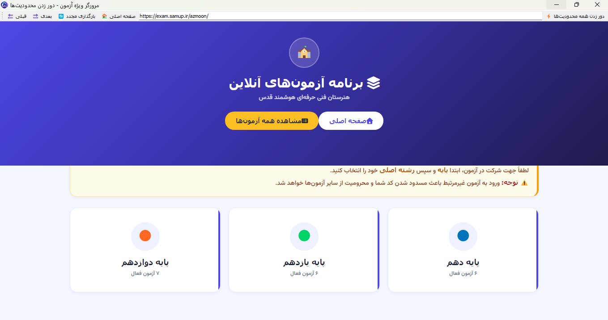

# 🔓 Exam Browser Bypass

مرورگر اختصاصی برای دور زدن محدودیت‌های آزمون‌های آنلاین ساخته شده با PyQt5

<div align="center">
  
</div>

---

## ✨ قابلیت‌ها

- ✅ کپی و پیست در صفحات آزمون
- ✅ راست کلیک فعال
- ✅ رفرش با F5
- ✅ دور زدن تشخیص خروج از تب
- ❌ DevTools (فعلاً باز نمیشه، تو نسخه بعدی رفع میشه)

---

## 🛠️ نصب و اجرا

```bash
# 1. کلون کن
git clone https://github.com/MatinHSDeveloper/Exam-Browser-Bypass.git
cd Exam-Browser-Bypass

# 2. کتابخانه‌ها رو نصب کن
pip install -r requirements.txt

# 3. اجرا کن
python exam_browser.py
```
---

## 📁 ساختار فایل‌ها

```
Exam-Browser-Bypass/
├── exam_browser.py      # فایل اصلی
├── icon.ico             # آیکون برنامه
├── preview.png          # عکس پیش‌نمایش
├── requirements.txt     # کتابخانه‌ها
└── README.md            # همین فایل
```

---

## 👨‍💻 ساخته شده توسط

**Matin Haji Seftjani**

[GitHub](https://github.com/MatinHSDeveloper)

---

## ⚠️ توجه

این ابزار فقط برای **آموزش و تست امنیت** ساخته شده. مسئولیت استفاده به عهده خودته.

---
